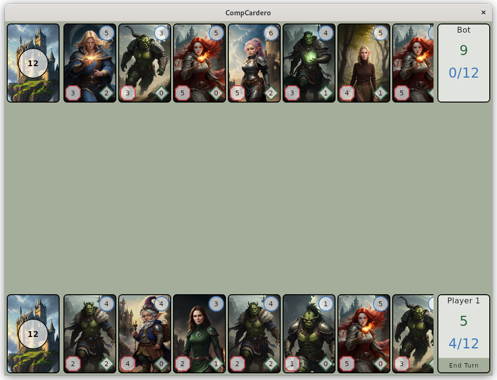

# CompCardero
CompCardero is a simple card game and sample for **Kotlin Multiplatform and Compose**.
It's developed for Android, iOS and desktop.

## Setting up the environment
See the [documentation of Kotlin Multiplatform](https://kotlinlang.org/docs/multiplatform-mobile-getting-started.html) for the required steps.

## Project structure
The project consists of the following modules:
- `composeApp`
    - `commonMain`: Common logic for Android, iOS and desktop.
    - `androidMain`: Specific code to build the Android app
    - `desktopMain`: The desktop application
    - `iOSMain`: Code specific to the iOS app
- `iosApp`: A Xcode project for the iOS app

### CompCardero is built with:
- [Kotlin Multiplatform](https://kotlinlang.org/docs/multiplatform.html): Just a great multiplatform framework
- [Compose Multiplatform](https://www.jetbrains.com/lp/compose-multiplatform/): Create beautiful declarative UIs 
- [Voyager](https://github.com/adrielcafe/voyager): Easy to use navigation library
- [KOIN](https://github.com/InsertKoinIO/koin): Simple and clean dependency injection framework
- [MOKO resources](https://github.com/icerockdev/moko-resources): Great for handling resources
- [Multiplatform Settings](https://github.com/russhwolf/multiplatform-settings): So good to persist key-value data for all platforms

...and [many more](gradle/libs.versions.toml)

## Play the Game
The game itself is a simple deck/trading card game. 
- You start with a deck of cards, some hand cards, current/max energy (blue) and health (green)
- Playing a card costs energy (blue circle). A card can attack (red) the enemy and heal (green) yourself
- Every round your current energy and max energy increases
- Every round you can play cards until no energy is left
- The human player and the bot play in turns until one has zero health
You can configure the game settings like hand size, energy and health when starting a new game

## Cards
The cards are generated with [Stable Diffusion 1.5](https://github.com/CompVis/stable-diffusion) 

## Contribution
Feel free to contribute via pull requests.

## License
The project is licensed by the [Apache 2 license](LICENSE).
